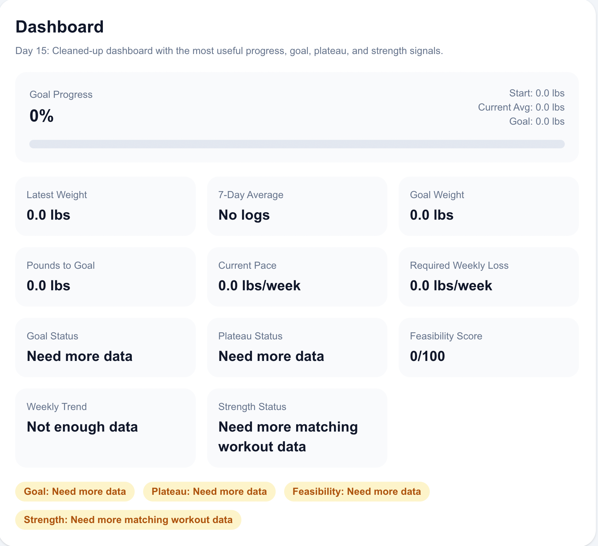
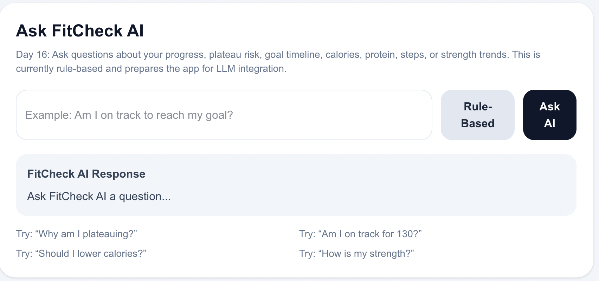
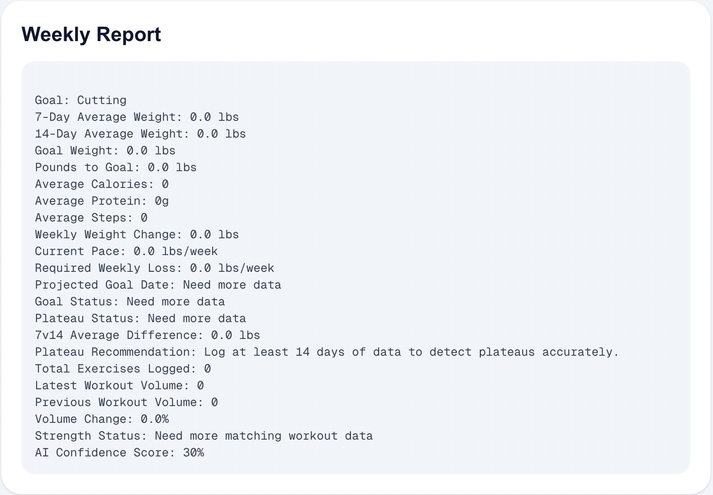
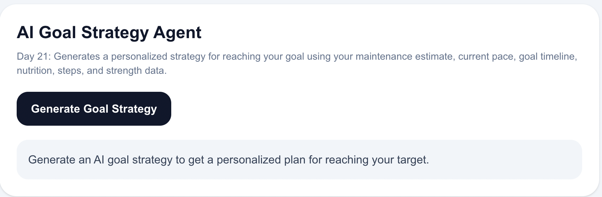
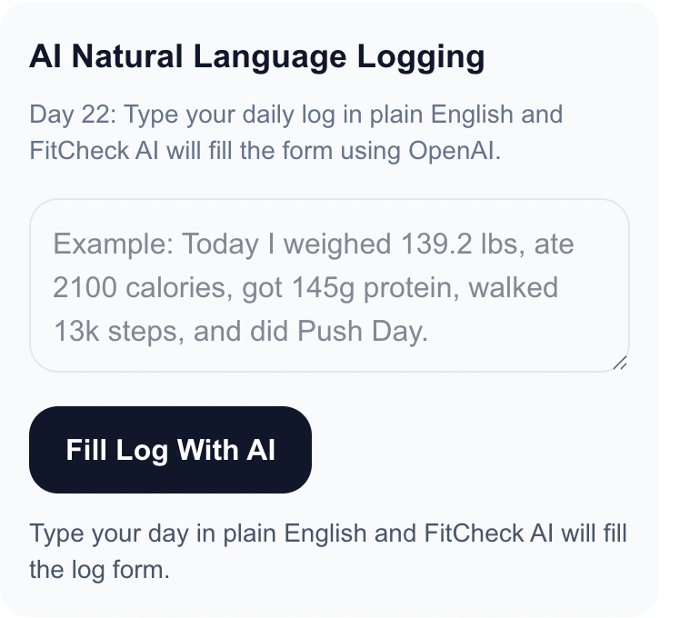
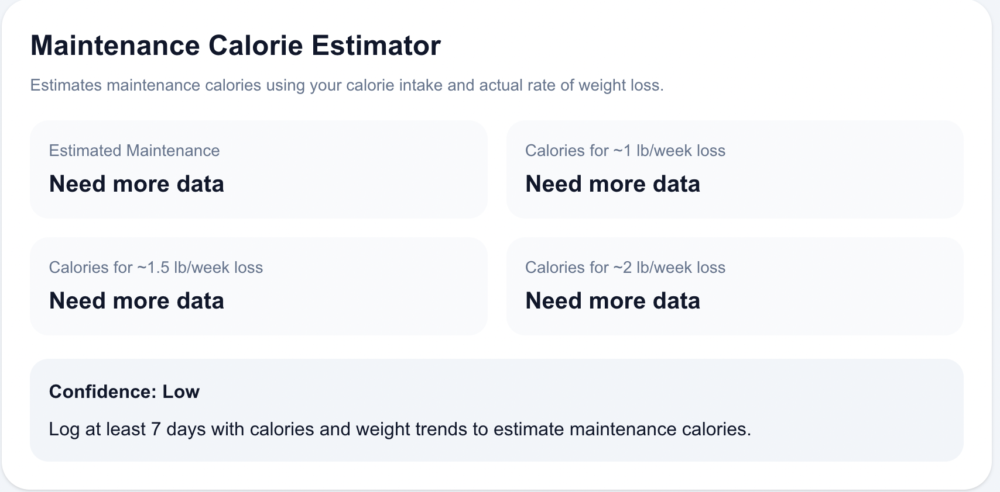
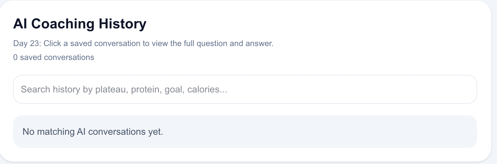

# FitCheck AI

## Overview

FitCheck AI is an AI-powered fitness analytics platform built with Next.js, React, TypeScript, Tailwind CSS, OpenAI API, Recharts, GitHub, and Vercel.

The application tracks weight, calories, protein, steps, workouts, and exercise performance while providing personalized coaching and analytics through AI-powered features.

## Screenshots

### Dashboard

### Ask FitCheck AI

### AI Weekly Report

### AI Goal Strategy Agent

### AI Natural Language Logging

### Maintenance Calorie Estimator

### AI Coaching History

## Features

- Daily fitness logging
- Weight tracking
- Calorie tracking
- Protein tracking
- Step tracking
- Exercise tracking
- Goal forecasting
- Goal feasibility analysis
- Plateau detection
- Maintenance calorie estimation
- Strength analytics
- AI Weekly Reports
- AI Goal Strategy Agent
- AI Natural Language Logging
- AI Coaching History
- OpenAI-powered coaching

## Tech Stack

- Next.js
- React
- TypeScript
- Tailwind CSS
- OpenAI API
- Recharts
- Vercel
- GitHub
- localStorage

## Architecture

User Interface

↓

Next.js Dashboard

↓

Analytics Engine

↓

Next.js API Routes

↓

OpenAI API

## Current Limitations

- Data stored in localStorage
- No cloud sync
- No user authentication
- No database

## Future Roadmap

- Supabase
- User accounts
- Cloud syncing
- Advanced AI coaching
- Mobile app

## Status

Currently under active development.